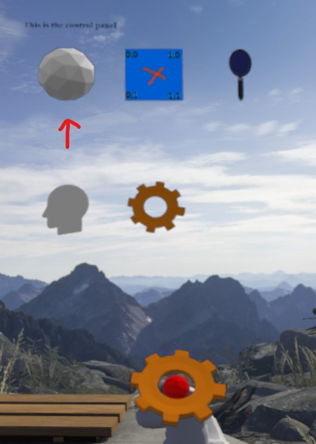
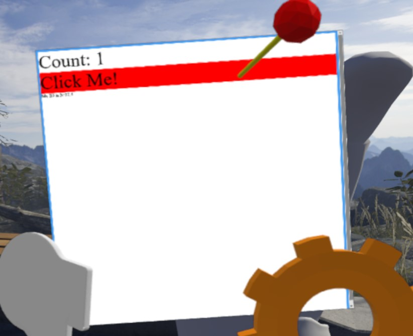

# Building your first Aardvark gadget

This is a simple step by step guide to building your first Aardvark gadget.
Assuming you have the pre-requisites installed already, this will take about ten minutes.

This guide uses Typescript, Visual Studio Code, and npm.
Using Javascript to build your gadget should be straightforward... just use .js files below instead of .ts files and omit the type declarations.

# Step 0 - Pre-requisites

There are some pre-requisites to following the rest of this guide.
Specifically you need to have the following applications installed:
* [Visual Studio Code](https://code.visualstudio.com/download)
* [npm](https://www.npmjs.com/get-npm)
* typescript - Once npm is installed, you can install typescript with `npm install -g typescript`
* avcmd - This is a command line tool for Aardvark developers. Once npm is installed, you can install it with `npm install -g @aardvarkxr/aardvark-cli`.

There's nothing in the instructions below that cares what platform you're running on, but these instructions have only been tested on Windows 10.
Aardvark itself also currently only runs on Windows.

# Step 1 - Initialize an empty gadget

The Aardvark init tool will help you create a mostly-blank project in the current directory.

```console
E:\gettingstarted>npm init @aardvarkxr
Aardvark gadget project create script (0.4.0)
? What is the package name to use for your gadget? mygadget
? What is the package name to use for your gadget? mygadget
? What is the user-facing name of your gadget? My Awesome Gadget
? What is the user-facing name of your gadget? My Awesome Gadget
? Does your gadget use panels (i.e. 2D quads in the world)? (Y/n)
? Does your gadget use panels (i.e. 2D quads in the world)? Yes
? Texture width (1024)
? Texture width 1024
? Texture height (1024)
? Texture height 1024
? Does your gadget start other gadgets? (y/N)
? Does your gadget start other gadgets? No
? Does your gadget join multi-user chambers? (y/N)
? Does your gadget join multi-user chambers? No
? Do you want to debug with VS Code? (Y/n)
? Do you want to debug with VS Code? Yes
Your answers:  {
  packageName: 'mygadget',
  gadgetName: 'My Awesome Gadget',
  usesPanels: true,
  width: 1024,
  height: 1024,
  startsGadgets: false,
  joinsChambers: false,
  wantsVSCode: true
}
Using @aardvarkxr/aardvark-react@^0.4.0 and @aardvarkxr/aardvark-shared@^0.4.0
Created ./src
Added gadget_manifest.json
Added tsconfig.json
Added package.json
Added src/styles.css
Added src/main.tsx
Added src/index.html
Created ./src/models
Added src/models/placeholder.glb
Added webpack.config.js
Created ./.vscode
Added .vscode/launch.json
```

This results in the following files:
```
E:\GETTINGSTARTED
|   package.json
|   tsconfig.json
|   webpack.config.js
|
+---.vscode
|       launch.json
|
\---src
    |   gadget_manifest.json
    |   index.html
    |   main.tsx
    |   styles.css
    |
    \---models
            placeholder.glb
```

Now that you have a gadget project, open it in Visual Studio code.

```console
E:\gettingstarted> code .
```

# Step 2 - Build your gadget for the first time

In the terminal window in Visual Studio code, you need to tell npm to install all the dependencies of your gadget. 
This will download a bunch of typescript and javascript files into `E:\gettingstarted\node_modules`.

First, open the terminal window from the Terminal menu:


In the pane that appears, run npm install.
You will need to do this whenever you change package.json to add dependencies.
This guide will walk through enough npm commands to get a gadget up and running, but if want to learn more about npm [An Absolute Beginner's Guide to npm](https://nodesource.com/blog/an-absolute-beginners-guide-to-using-npm/) would be a good place to start.
(This output was truncated because npm loves to spam the console, and the specific spam varies from week to week depending on other people's modules, the specific npm version, security alerts, and the phase of the moon.)

```console
PS E:\gettingstarted> npm install
npm WARN deprecated request@2.88.2: request has been deprecated, see https://github.com/request/request/issues/3142

> node@12.16.1 preinstall E:\gettingstarted\node_modules\node
> node installArchSpecificPackage

+ node-win-x64@12.16.1
added 1 package in 1.019s
found 0 vulnerabilities

npm notice created a lockfile as package-lock.json. You should commit this file.
npm WARN optional SKIPPING OPTIONAL DEPENDENCY: fsevents@^1.2.7 (node_modules\chokidar\node_modules\fsevents):
npm WARN notsup SKIPPING OPTIONAL DEPENDENCY: Unsupported platform for fsevents@1.2.12: wanted {"os":"darwin","arch":"any"} (current: {"os":"win32","arch":"x64"})
npm WARN mygadget@0.1.0 No repository field.
npm WARN mygadget@0.1.0 No license field.
...

added 999 packages from 1189 contributors and audited 54181 packages in 31.898s

21 packages are looking for funding
  run `npm fund` for details

found 0 vulnerabilities
```

Now that the dependencies are installed we can start the actual build.

```console
PS E:\gettingstarted> npm start

> mygadget@0.1.0 start E:\gettingstarted
> webpack --env=dev --watch --progress

10% [0] building 0/0 modules 0 active
webpack is watching the files...

Hash: 7761bd5deb168075e44e
Version: webpack 4.42.1
Child
    Hash: 7761bd5deb168075e44e
    Time: 3014ms
    Built at: 04/04/2020 9:47:13 AM
                     Asset       Size  Chunks             Chunk Names
              ./index.html  297 bytes          [emitted]
      gadget_manifest.json  168 bytes          [emitted]
                  index.js   10.9 MiB    main  [emitted]  main
                 main.d.ts   12 bytes          [emitted]
    models/placeholder.glb   9.38 KiB          [emitted]
                styles.css  391 bytes          [emitted]
    Entrypoint main = index.js
    [0] util (ignored) 15 bytes {main} [built]
    [1] util (ignored) 15 bytes {main} [built]
    [2] buffer (ignored) 15 bytes {main} [optional] [built]
    [3] crypto (ignored) 15 bytes {main} [optional] [built]
    [./node_modules/webpack/buildin/global.js] (webpack)/buildin/global.js 472 bytes {main} [built]
    [./node_modules/webpack/buildin/module.js] (webpack)/buildin/module.js 497 bytes {main} [built]
    [./src/main.tsx] 3.67 KiB {main} [built]
        + 167 hidden modules
    Child html-webpack-plugin for "index.html":
         1 asset
        Entrypoint undefined = ./index.html
        [./node_modules/html-webpack-plugin/lib/loader.js!./src/index.html] 428 bytes {0} [built]
        [./node_modules/webpack/buildin/global.js] (webpack)/buildin/global.js 472 bytes {0} [built]
        [./node_modules/webpack/buildin/module.js] (webpack)/buildin/module.js 497 bytes {0} [built]
            + 1 hidden module
```

Exactly what `npm start` does is controlled by the scripts section of the gadget's package.json file.

```json
	"scripts": {
		"build": "webpack --env=production",
		"start": "webpack --env=dev --watch --progress"
	},
```

By default the init script sets package.json up to run a tool called webpack to bundle all the code and other assets for the gadget up into the `dist` directory, and then watch the source files for any changes.
Changing any of the source files will cause webpack to build again and update the output files automatically.

At this point the output directory should look like this:
```
E:\GETTINGSTARTED\DIST
|   gadget_manifest.json
|   index.html
|   index.js
|   main.d.ts
|   styles.css
|
+---models
        placeholder.glb
```

The tsconfig.json and webpackconfig.js files in your gadget's source tree control this transpile and bundling process.
For more details on how all of that works, [How to Setup TypeScript with Webpack 4](https://appdividend.com/2018/03/18/how-to-setup-typescript-with-webpack-4/) is a good introduction.


# Step 3 - Running your gadget for the first time

First you need to install your gadget.

```console
E:\gettingstarted>avcmd install dist
Read state from C:\Users\username\aardvark\state.json for 5 active gadgets
info: Installing My Awesome Gadget: file:///E:/gettingstarted/dist
info: writing state to C:\Users\username\aardvark\state.json
```

Then run Aardvark and you will see your gadget show up in the gadget menu.
The white sphere is the placeholder model.



If you grab the placeholder sphere icon, you'll see your gadget's panel.




# Step 4 - Understanding gadget_manifest.json

Your gadget's src directory contains a file called gadget_manifest.json that has the following in it.
```json
{
	"name": "My Awesome Gadget",
	"permissions": [
		"scenegraph"
	],
	"width": 1024,
	"height": 1024,
	"model": "models/placeholder.glb",
	"startAutomatically": false
}
```

Every gadget needs to define a manifest file to tell Aardvark how to deal with that gadget. The fields in the manifest file are:
* name - The user facing name of the gadget. This isn't currently shown to a user anywhere, but please set one anyway.
* permissions - Aardvark has a rudimentary permission system that allows gadgets to have access to certain blocks of functionality. Possible values are:
  * scenegraph - The gadget is allowed to submit a scene graph. Pretty much every gadget has this permission.
  * chamber - The gadget is allowed to join and leave chambers on behalf of the user.
  * master - The gadget is the master gadget and is allowed to start other gadgets. You shouldn't set this in your own gadget. 
* width, height - The width and height of the browser that is created for this gadget. Gadgets that don't use panels should set this to small numbers like 16x16 to save on video memory. 
* model - The URL of a glTF model to use to represent this gadget in the gadget menu. If this does not start with HTTP or HTTPS it must be a relative file path (using forward slashes) to the model file that is relative to the gadget manifest file itself.
* startAutomatically - If this is true and the gadget is installed, the gadget will start automatically when Aardvark starts. This is useful for gadgets that don't have a grabbable at their root. Defaults to false.
* shareInChamber - If this is true, the gadget will be shared with other members of any chamber that the local user is a member of. Defaults to true.


# Step 5 - Understanding the gadget scene graph

`main.tsx` is a typescript file that defines the main React component in the simple starter gadget.
Understanding what React components are and how they work would go a long way toward understanding how Aardvark works, so it may be worth reading about that in [their own getting started guide](https://www.pluralsight.com/guides/typescript-react-getting-started).
This guide won't get into the Reactisms of the gadget itself and will instead focus on the Aardvarkisms.

The core of an Aardvark gadget is its scene graph.
This tells Aardvark what do draw for the gadget, as well as how the user should be able to interact with that gadget. 
It is constructed of React components that follow the Av<whatever> naming convention, and returned by the render function of any components defined in each gadget.

This is the render function of the TestPanel component in `main.tsx`:
```tsx
public render()
{
	let sDivClasses:string;
	let scale = 0.2;
	switch( this.state.grabbableHighlight )
	{
		default:
		case HighlightType.None:
			sDivClasses = "FullPage NoGrabHighlight";
			break;

		case HighlightType.InRange:
			sDivClasses = "FullPage InRangeHighlight";
			break;

		case HighlightType.Grabbed:
			sDivClasses = "FullPage GrabbedHighlight";
			break;

		case HighlightType.InHookRange:
			sDivClasses = "FullPage GrabbedHighlight";
			break;
	
	}

	return (
		<div className={ sDivClasses } >
			<div>
				<AvGrabbable updateHighlight={ this.onHighlightGrabbable }
					onGrabRequest={ this.onGrabRequest }
					dropOnHooks={ true }>
					<AvSphereHandle radius={0.1} />
					
					<AvTransform uniformScale={ scale }>
						<AvPanel interactive={true}
							onIdAssigned={ (id: EndpointAddr) => { this.m_panelId = id } }/>
					</AvTransform>
				</AvGrabbable>
			</div>
			<div className="Label">Count: { this.state.count }</div>
			<div className="Button" onMouseDown={ this.incrementCount }>
				Click Me!
				</div> 

			{ this.m_panelId && 
				<div>
					My ID is { endpointAddrToString( this.m_panelId as EndpointAddr ) }
				</div>
			}
		</div>
	)
}
```

This is the scene graph portion of that function:
```tsx
<AvGrabbable updateHighlight={ this.onHighlightGrabbable }
	onGrabRequest={ this.onGrabRequest }
	dropOnHooks={ true }>
	<AvSphereHandle radius={0.1} />
	
	<AvTransform uniformScale={ scale }>
		<AvPanel interactive={true}
			onIdAssigned={ (id: EndpointAddr) => { this.m_panelId = id } }/>
	</AvTransform>
</AvGrabbable>
```

The [Aardvark React documentation](https://aardvarkxr.github.io/aardvark/aardvark-react/) describes all the available node types in Aardvark, as well as what their properties are. 
A few of those are detailed below to explain how they work in the test panel gadget.

## AvGrabbable

There is often a node of this type at the root of gadgets.
It allows the user to grab the gadget and move it around.

This grabbable defines an optional updateHighlight callback function and uses that function to change the color of the panel when a grabber is near the gadget, or when the grabbable is actually being moved around. 
The specific highlighting being used here is more of a test/demonstration than something you would want to use in your own gadget, but it shows you how to hook up this sort of highlighting.
You could use the same callback to change the scale of an object, show or hide things, change the color of a model, etc.

## AvSphereHandle

Grabbables themselves don't define the region that they can be grabbed in.
They rely on handles for that. 

In this case the grabbable is using a sphere handle with a radius of 0.1 meters (because all distance values in Aardvark are in meters).
This sphere is centered around its parent transform in the scene graph.
In this case, because there are no transform nodes above it in the scene graph, the handle is centered around the gadget itself.

## AvTransform

Almost every gadget will use an `AvTransform` node somewhere.
This node sets the translation, scale, and rotation of its children.

`AvTransform` sometimes works in concert with the `AvOrigin` node, which sets the scene graph transform to some absolute point like:
* /user/head - the user's head with the negative Z axis coming out between their eyes and the positive Y axis going up out the top of their head.
* /user/hand/left, /user/hand/right - the user's hand, with the negative Z axis going forward away from their hand.
* /space/stage - The center of the user's room-scale playspace.


## AvPanel

This is another very common node type.
It tells Aardvark to present the contents of the gadget's browser as a 2D panel in the world. 
The size of this panel defaults to 1m by 1m, which is pretty big for a display surface, so it is often paired with an `AvTransform` node that scales down the panel. 
That's what's happening here with the `AvTransform` parent of the `AvPanel` node.

For panels that want user interaction through simulated "mouse" clicks, they can set the `interactive` property.
At that point onClick and all the other expected DOM and React events will come through for that panel.

# Step 6 - Come ask for help!

That should be enough to get you going.
As you run into issues building your gadget, please don't hesitate to reach out in the Aardvark Slack. 
That's how we're going to make the API, this guide, the documentation, and all of Aardvark better.

Thanks for reading
