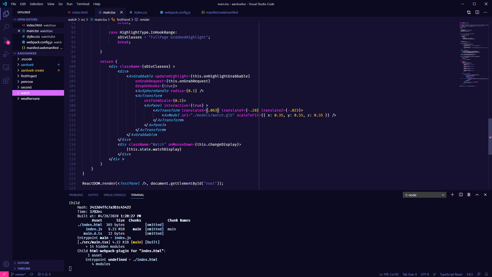
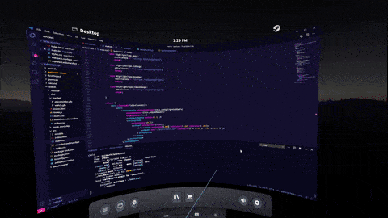
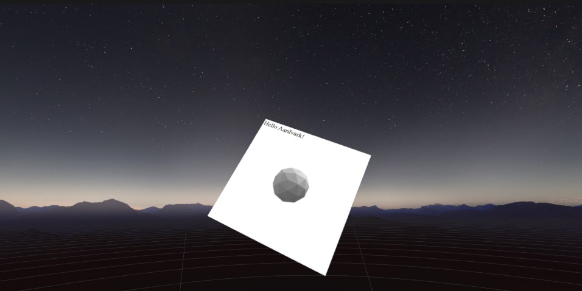
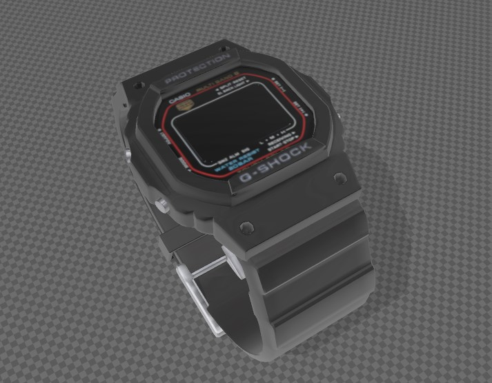
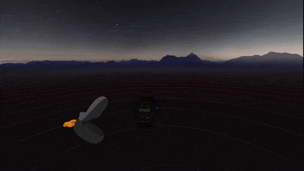

# Let's Make A Watch Gadget!

This tutorial is intended to follow the [first one](https://aardvarkxr.github.io/aardvark/getting_started/), where you've learned about the prerequisites for developing AardvarkXR gadgets, gadget initialization, and some scene graph anatomy. If you haven't worked through that tutorial yet, please do so and come back when you're ready for more - we'll be building on that information and assuming you've mastered the basics.

In this guide we'll be building a simple digital watch; we'll utilize panels and 3D models and implement a a little interactivity. Once you've worked through this guide, you should have two things:

* A vintage, functioning 90s G-Shock watch gadget 
* A better understanding of the Aardvark scene graph, familiarity with useful nodes, and the gadget development workflow.

# Step 1: _The First Time_ - Tooling and debugging

If you've worked on wearable VR/AR experiences, you're already familiar with the ergonomic difficulties of iterating on development and alternating between coding (headset off) and testing (headset on). You might already have a workflow you're comfortable with that mitigates this, in which case feel free to skim or skip this section. In any case, here's my typical workflow in the hope that it might be of use to you too:

1. I like to stay in VR and work in the virtual desktop to minimize headset fidgeting time. It's worth knowing there are several good VR desktop solutions available like [this one, ](https://www.vrdesktop.net/) [this one, ](https://store.steampowered.com/app/457550/Bigscreen_Beta/) [this one](https://store.steampowered.com/app/1068820/OVR_Toolkit/) and [this one](https://store.steampowered.com/app/1178460/Desktop_Portal/) that play well with SteamVR, some of which look and feel much better than the built-in one. 

2. Coding is done in VS Code, with the `npm start` script running in VS Code's terminal (you can launch a new terminal instance from VS Code's Terminal tab):
   


Note that the script watches the files and recompiles on change, so you don't have to "refresh" anything aside from hitting save.

2. When iterating, the Aardvark renderer does *not* have to be restarted to reflect gadget updates but you *do* have to instantiate a new gadget every time you want to see the latest compiled changes (and probably want to discard that gadget after testing).
This is what my workflow typically looks like - IDE, test in SteamVR, back to IDE:



3. For debugging, remember you can use Chrome's devtools on the Aardvark Server (http://localhost:8042/), as well as the Gadget Monitor (http://localhost:23842/gadgets/aardvark_monitor/index.html). You can also debug your gadget from VS Code, provided you've installed the Debugger for Chrome extension and answered "yes" to the `Do you want to debug with VS Code?` question when [instantiating your gadget](https://aardvarkxr.github.io/aardvark/getting_started/). 


# Step 2: _Time of the Season_ - Adding a time/date panel

Alright, now that we've got a dev environment and a nice workflow, we can jump into the code. 

You can find and download the **necessary media assets** we'll be using [here](https://github.com/MichaelHazani/av-watch-gadget/tree/master/PROJECT_ASSETS). You'll notice that repo is the finished project, but I highly recommend starting from scratch and working your way through the tutorial). 

Let's start by [instantiating a new gadget](https://aardvarkxr.github.io/aardvark/getting_started/). Give it any name you want, and select the defaults for everything (see the [previous tutorial](https://aardvarkxr.github.io/aardvark/getting_started/) for a recap if you'd like). 

We'll be working primarily in `main.tsx` and `styles.css` located in the `src/` folder, which (after running `npm start` as described in the previous tutorial) get recompiled to the `dist/` folder after every save. This is an important fact to keep in mind; for one thing, you'll want to place whatever 3D models and various media files you'll be using in the `dist` folder since that'll be the root of your local references - where `main.tsx` will be solving paths from.

Now, let's shave down the default scene graph created in `main.tsx` to a minimum, so that it only contains the bare bones:

```tsx
import * as React from 'react';
import * as ReactDOM from 'react-dom';

import bind from 'bind-decorator';

import { AvGadget, AvTransform, AvPanel, AvGrabbable, 
HighlightType, GrabResponse, AvSphereHandle, 
AvTransformControl, AvPanelAnchor, AvModel } from '@aardvarkxr/aardvark-react';

import { EndpointAddr, AvGrabEvent, endpointAddrToString } from '@aardvarkxr/aardvark-shared';

interface WatchState {}

class WatchGadget extends React.Component<{}, WatchState>
{
	constructor(props: any) {
	super(props);
	}

	public render() {
		let scale = 0.2;

return (
	<div>
		<AvGrabbable dropOnHooks={true}>
			<AvSphereHandle radius={0.1} />
			<AvTransform uniformScale={0.2}>
				<AvPanel interactive={true} >
				</AvPanel>
			</AvTransform>
		</AvGrabbable>
	</div>
		)
	}
}
ReactDOM.render(<WatchGadget />, document.getElementById("root"));
```

You'll notice we've kept a few things that will be immediately useful: 
*  `<AvSphereHandle />`, because we'll want to interact with our gadget - no sense in losing the handler. 
*  `<AvTransform>` to easily manipulate our panel, as well as the contained panel.

Aside from that, and new empty WatchState object and a few naming tweaks, this is a barebones version of the default gadget. Let's get to work!

First, right before the final `</div>` tag in the `render` method, let's add a simple sanity check to make sure our dev environment is fully functional and the gadget is being updated:

```tsx
<div className="Watch">
	Hello Aardvark!
</div>
```
Upon saving and instantiating a new gadget, you should be able to see immediate results, but they'll default to the size of fairly small chicken scratch. In `styles.css`, let's fix that!

```css
.Watch
{
	font-size: 4rem;
}
```


Now we're cooking with fire. Let's get it looking like a proper digital watch. We'll tweak the CSS of the `.Watch` class so that the numbers utilize a proper digital font (I picked the freely available [Digital 7](https://www.1001fonts.com/digital-7-font.html), and position it somewhere that'll make sense once we add the digital watch model.

A nice trick here is making the panel background transparent, because we don't want a "page" as much as "digits displayed on a watch's screen". Here's `styles.css`:

```css
@font-face {
	font-family: 'digital-7';
	src: url('./fonts/digital-7\ \(mono\).ttf')
}

body, html {
	background-color: transparent;
}

.Watch {
	font-family: 'digital-7', monospace;
	font-size: 2.8rem;
	color: #4Af626;
	margin-top: 47%;
	margin-left:48%;
	max-width: 1.5rem;
	text-align: center;
}
```
et voilà!


# Step 3: _Time After Time_ - Adding the Watch model

After scouring Poly and Sketchfab for good, free digital watch models, I found this [great-looking, downloadable photogrammetized model of a Casio G-Shock](https://sketchfab.com/3d-models/casio-g-shock-digital-watch-b6466b64dd8b495c99f24a5054491f4d) by [jeandiz](https://sketchfab.com/jeandiz). Clocking in at ~25MB, its textures are way too nice and detailed for our purposes, so I've resized them in imagemagick and did some model cleanup in Blender; you can find the optimized, <1MB gltf file [here](media/watch.glb). 



Let's add this make this the gadget preview model while we're at it! in `manifest.webmanifest`, under `icons`, change to:
```webmanifest
	"icons": [
		{
			"src": "models/watch.glb",
			"type": "model/gltf-binary"
		}
	],
```
**important** - remember to add the watch (and all gltf models) to your **`dist/models`** folder, not `src/models`! gltf models do not get copied over as part of the compilation flow - the path is relative from `dist/manifest.webmanifest`.

Now that our gadget preview is all set up, let's add the watch to the gadget itself:
```tsx
<div>
	<AvGrabbable dropOnHooks={true}>
		<AvSphereHandle radius={0.1} />
		<AvTransform uniformScale={0.2}>
			<AvPanel interactive={true} >
				<AvTransform translateX={.063} translateY={-.28} translateZ={-.023}>
					<AvModel uri="./models/watch.glb" scaleToFit={{ x: 0.35, y: 0.35, z: 0.35 }} />
				</AvTransform>
				<div className="Watch">
				Hello Aardvark!
				</div>
			</AvPanel>
		</AvTransform>
	</AvGrabbable>
</div>
```

Not *too* much happening here. Inside AvPanel, we've added a `<AvTransform>` component and inside *it*, an `<AvModel>` component. We're using the `<AvTransform>` component to place the model where we want it in the gadget and `<AvModel>`'s `scaleToFit` property to lock the model's scale into an (imaginary) box of a certain size. The values are a result of trial and error - our main concern is having the watch in a reasonable place and setting the digits' size and location with CSS.

# Step 4: _Time for Action_ - Making it interactive

Alright, so we've got a watch; time (heh) to make it tick! 
In the spirit of old school digital watches, let's have a `time` display and - when the screen is "pressed" - a `date` display as well. We'll start by adding a "watchDisplay" string and an instance of a "watchDisplayType" enum to our state interface, to manage the display state:

```tsx
enum watchDisplayType {
	Time,
	Date
}

interface WatchState {
	watchDisplayTypeInstance: watchDisplayType;
	watchDisplay: string;
}
```

In the `WatchGadget` class, we'll: 
* initialize this state in the constructor 
* add class methods to keep time & update the display state

```tsx

class WatchGadget extends React.Component<{}, WatchState> {

    constructor(props: any) {
			super(props);
			this.state =
			{
				watchDisplayTypeInstance: watchDisplayType.Time,
				watchDisplay: ""
			};
    }
		
    componentDidMount() {
			setInterval(this.getTime, 1000);
    }

    @bind public getTime() {
			switch (this.state.watchDisplayTypeInstance) {

            case watchDisplayType.Time:
                this.setState({ watchDisplay: new Date().toLocaleTimeString() });
                break;

            case watchDisplayType.Date:
                this.setState({ watchDisplay: new Date().toLocaleDateString(
								undefined, 
								{ month: "2-digit", day: "2-digit", year: "2-digit" })});
                break;
			
						default:
							break;
			}
		}

    @bind public changeDisplay() {
        this.state.watchDisplayTypeInstance == watchDisplayType.Date ?
            this.setState({ watchDisplayTypeInstance: watchDisplayType.Time }) :
            this.setState({ watchDisplayTypeInstance: watchDisplayType.Date });    
		}
}
```

finally, we'll update what we're displaying in the `Watch` div and add an `onMouseDown` event handler, in order to trigger the display change:

```tsx
	<div className="Watch" onMouseDown={this.changeDisplay}>
		{this.state.watchDisplay}
	</div>
```

Here's `main.tsx` after our changes:

```tsx
import * as React from 'react';
import * as ReactDOM from 'react-dom';

import bind from 'bind-decorator';

import { AvGadget, AvTransform, AvPanel, AvGrabbable, 
HighlightType, GrabResponse, AvSphereHandle, AvTransformControl, 
AvPanelAnchor, AvModel } from '@aardvarkxr/aardvark-react';
import { EndpointAddr, AvGrabEvent, 
endpointAddrToString } from '@aardvarkxr/aardvark-shared';

enum watchDisplayType {
	Time,
	Date
}

interface WatchState {
	watchDisplayTypeInstance: watchDisplayType;
	watchDisplay: string;
}

class WatchGadget extends React.Component<{}, WatchState> {
	constructor(props: any) {
			super(props);
			this.state =
			{
				watchDisplayTypeInstance: watchDisplayType.Time,
				watchDisplay: ""
			};
	}

	componentDidMount() {
			setInterval(this.getTime, 1000);
	}

	@bind public getTime() {
		switch (this.state.watchDisplayTypeInstance) {
			
				case watchDisplayType.Time:
					this.setState({ watchDisplay: new Date().toLocaleTimeString() });
					break;

				case watchDisplayType.Date:
					this.setState({ watchDisplay: new Date().toLocaleDateString(
					undefined, 
					{ month: "2-digit", day: "2-digit", year: "2-digit" }) });
					break;

				default:
					break;
		}
	}

	@bind public changeDisplay() {
		this.state.watchDisplayTypeInstance == watchDisplayType.Date ?
			this.setState({ watchDisplayTypeInstance: watchDisplayType.Time }) :
			this.setState({ watchDisplayTypeInstance: watchDisplayType.Date });
	}

	public render() {
		let scale = 0.2;

		return (
			<div >
				<div>
					<AvGrabbable dropOnHooks={true}>
						<AvSphereHandle radius={0.1} />
						<AvTransform
							uniformScale={0.2}>
							<AvPanel interactive={true} >
								<div className="Watch" onMouseDown={this.changeDisplay}>
									{this.state.watchDisplay}
								</div>
								<AvTransform translateX={.063}
									    	     translateY={-.28}
									     	     translateZ={-.023}>
									<AvModel uri="./models/watch.glb"
										scaleToFit={{
											x: 0.35,
											y: 0.35,
											z: 0.35
										}} />
								</AvTransform>
							</AvPanel>
						</AvTransform>
					</AvGrabbable>
				</div>
			</div >
		)
	}
}

ReactDOM.render(<WatchGadget />, document.getElementById("root"));
```

And here's our gadget in action:



There you have it. Your own Casio Watch gadget. Now go wander the metaverse in style!

# Step 5: _Closing Time_ - a few tips for the road:

* Remember, Aardvark is designed as an overlay for **gadgets**. It's open source, built with the state of the art frameworks and standards, and can do quite a lot - but it's best thought of as a tool for making the _things_ in the **people-places-things** trifecta. While you could conceivably use it to make places (or, ahem, _people_?) - it is decidedly not its purpose or planned use case; _things_ are where it shines. 
     
* The [Aardvark React documentation](https://aardvarkxr.github.io/aardvark/aardvark-react/) is a good next step: it describes most of the available node types in Aardvark, as well as what their properties are. 

* Work on Aardvark is currently in progress. Docs are constantly updated, the API evolves almost daily, and new features land frequently. You're welcome to join the [AardvarkXR Slack](aardvarkxr.slack.com) to chat with the folks working on it and have your questions answered, your feedback listened to and your troubles melt away like lemon drops. You should also drop by if you've made something cool and would like to share it or even have it featured.

Thanks for reading, and happy hacking!

--------------------
