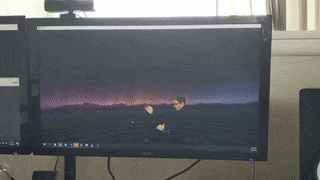

# Let's Make A Watch Gadget!

This tutorial is intended to follow the [first one](https://aardvarkxr.github.io/aardvark/getting_started/), where you've learned about the prerequisites for developing AardvarkXR gadgets, gadget initialization, and some scene graph anatomy. If you haven't worked through that tutorial yet, please do so and come back when you're ready for more - we'll be building on that information and assuming you've mastered the basics.

In this guide we'll be building a simple digital watch; we'll utilize a panel and a 3D model, and implement a a little interactivity. Once you've worked through this guide, you should have two things:

- A vintage 90s G-Shock watch gadget with a time/date display
- A better understanding of the Aardvark scene graph, familiarity with useful nodes, and the gadget development workflow.

# Step 1: _The First Time_ - Tooling and debugging

If you've worked on wearable VR/AR experiences, you're already familiar with the ergonomic difficulties of iterating on development and alternating between coding (headset off) and testing (headset on). You might already have a workflow you're comfortable with that mitigates this, in which case feel free to skim or skip this section. In any case, here's my typical workflow in the hope that it might be of use to you too:

1. I like to stay in VR and work in the virtual desktop to minimize headset fidgeting time. It's worth knowing there are several good VR desktop solutions available like [this one, ](https://www.vrdesktop.net/) [this one, ](https://store.steampowered.com/app/457550/Bigscreen_Beta/) [this one](https://store.steampowered.com/app/1068820/OVR_Toolkit/) and [this one](https://store.steampowered.com/app/1178460/Desktop_Portal/) that play well with SteamVR, some of which look and feel much better than the built-in one.

2. Coding is done in VS Code, with the `npm start` script running in VS Code's terminal (you can launch a new terminal instance from VS Code's Terminal tab):


Remember you'll also have to be *serving the gadget locally* during iteration as described in the [first tutorial]((https://aardvarkxr.github.io/aardvark/getting_started/)).

Note that the script watches the files and recompiles on change, so you don't have to "refresh" anything aside from hitting save. When iterating, the Aardvark renderer does _not_ have to be restarted to reflect gadget updates but you _do_ have to instantiate a new gadget every time you want to see the latest compiled changes (and probably want to discard that gadget after testing).
This is what my workflow typically looks like - IDE, test in SteamVR, back to IDE:


3. For debugging, remember you can use Chrome's devtools on the Aardvark Server (http://localhost:8042/), as well as the Gadget Monitor (http://localhost:23842/gadgets/aardvark_monitor/index.html). You can also debug your gadget from VS Code, provided you've installed the Debugger for Chrome extension and answered "yes" to the `Do you want to debug with VS Code?` question when [instantiating your gadget](https://aardvarkxr.github.io/aardvark/getting_started/). You can then attach the debugger in VS Code and reload with the debugger widget button or ctrl-shift-F5. The create script will make a `launch.json` that attached to avrenderer to enable this.

# Step 2: _Time of the Season_ - Adding a time/date panel

Alright, now that we've got a dev environment and a nice workflow, we can jump into the code.

You can find the following code and the assets we'll be using [here](https://github.com/MichaelHazani/av-watch-gadget).

Let's start by [instantiating a new gadget](https://aardvarkxr.github.io/aardvark/getting_started/). Give it any name you want, and select the defaults for everything (check out the [previous tutorial](https://aardvarkxr.github.io/aardvark/getting_started/) if you'd like a recap).

We'll be working primarily in `main.tsx` and `styles.css` located in the `src/` folder, which (after running `npm start` as described in the previous tutorial) get recompiled to the `dist/` folder on every save. Remember that `dist/` will be the root of your local references - where the compiled `index.js` will be solving paths from.

Now, let's tweak `main.tsx` to a minimum, so that it only contains the bare bones:

```tsx
import { AvPanel, AvStandardGrabbable, AvTransform, DefaultLanding } from '@aardvarkxr/aardvark-react';
import { Av, g_builtinModelBox } from '@aardvarkxr/aardvark-shared';
import bind from 'bind-decorator';
import * as React from 'react';
import * as ReactDOM from 'react-dom';

interface WatchState {}

class WatchGadget extends React.Component< {}, WatchState >
{
	constructor( props: any ) {
		super( props );
	}

	public render()
	{
		return (
				<div>
					<AvStandardGrabbable modelUri={ g_builtinModelBox } modelScale={ 0.03 }>
						<AvTransform translateY={ 0.08 } >
							<AvPanel interactive={true} widthInMeters={ 0.1 }></AvPanel>
						</AvTransform>
					</AvStandardGrabbable>
				</div>
		);
	}
}

let main = Av() ? <WatchGadget/> : <DefaultLanding/>
ReactDOM.render( main, document.getElementById( "root" ) );

```

Note we're using the following nodes:

- `<AvStandardGrabbable>`, a node that conveniently gives us a grabbable handle and a model all at once. It's currently using the built in placeholder model for now (we'll be replacing it later), with its scale adjusted.
- `<AvTransform>` to easily manipulate the contained panel's size, position and rotation.
- `<AvPanel>` that we'll use to display the actual time.

We've timmed much more: note the fewer imported modules, the removal of methods for networking-related state-dependent rendering, etc. Finally, we added the `WatchState`  [interface](https://www.typescriptlang.org/docs/handbook/interfaces.html) that will hold the gadget state. All the pieces are there - let's get to work!

First, let's add a simple sanity check to make sure our dev environment is fully functional and the gadget is being updated - put this in your `<AvPanel>`:

```tsx
<div className="watch">Hello Aardvark!</div>
```

Upon saving and instantiating a new gadget, you should be able to see immediate results, but they'll default to the size of fairly small chicken scratch. In `styles.css`, let's fix that!

```css
.watch {
  font-size: 3rem;
}
```


Now we're cooking with fire. Let's get the text looking like a proper digital watch digits. We'll tweak the CSS of the `.watch` class so that the numbers utilize a nice digital font (I picked the freely available [Digital 7](https://www.1001fonts.com/digital-7-font.html), and position it somewhere that'll make sense once we add the digital watch model.

A nice trick here is making the panel background transparent, because we don't want a "page" as much as "digits displayed on a watch's screen". Here's `styles.css`:

```css
@font-face {
  font-family: "digital-7";
  src: url("./fonts/digital-7\ \(mono\).ttf");
}

body,
html {
  background-color: transparent;
}

.watch {
  font-family: "digital-7", monospace;
	font-size: 2.65rem;
  color: #4af626;
  margin-top: 47%;
  margin-left: 48%;
  max-width: 1.5rem;
}

```


et voilà!


# Step 3: _Time After Time_ - Adding the Watch model

After scouring Poly and Sketchfab for good, free digital watch models, I found this [great-looking, downloadable photogrammetized model of a Casio G-Shock](https://sketchfab.com/3d-models/casio-g-shock-digital-watch-b6466b64dd8b495c99f24a5054491f4d) by [jeandiz](https://sketchfab.com/jeandiz). Clocking in at ~25MB, its textures are way too nice and detailed for our purposes, so I've resized them in imagemagick and did some model cleanup in Blender; you can find the optimized, <1MB gltf file [here](./PROJECT_ASSETS/models/watch.glb).


Let's make this the gadget preview model while we're at it! in `manifest.webmanifest`, under `icons`, change to:

```webmanifest
	'icons': [
		{
			"src": "models/watch.glb",
			"type": "model/gltf-binary"
		}
	],
```

**important** - assets don't get automagically copied over in our webpack script. Let's head over to `webpack.config.js` and in `plugins`, under the `CopyPlugin` settings, add:

```json
({ "from": "./src/models/", "to": "models/" },
{ "from": "./src/fonts/", "to": "fonts/" })
```

to ensure that our model and font get properly copied over to the `dist` folder, which is our root, on every compile.

Now that our gadget preview is all set up, let's add the watch to the gadget itself. Here's our revised render function:

```tsx
	public render()
	{
		return (
      <div>
        <AvStandardGrabbable modelUri={"./models/watch.glb"} modelScale={0.03}>
          <AvTransform
            translateX={-0.012}
            translateY={0.063}
            translateZ={0.00375}
            rotateX={-90}
            uniformScale={0.2}
          >
            <AvPanel widthInMeters={1.23} interactive={true}>
								<div className="watch">Hello Aardvark!</div>
            </AvPanel>
          </AvTransform>
        </AvStandardGrabbable>
      </div>
		);
	}
```

Not _too_ much happening here. First, note that we've changed the model in `<AvStandardGrabbable>` to be our watch. We're using the `<AvTransform>` component to place the text (which will soon be the time/date) relatively to the model. The values are a result of trial and error - our main concern is having the watch in a reasonable place and setting the digits' size and location with the `<AvTransform>` values and the `.watch` class' CSS.

# Step 4: _Time for Action_ - Making things interactive

Alright, so we've got a watch; time (heh) to make it tick!
In the spirit of old school digital watches, let's have a `time` display and - when the screen is "clicked" with a VR controller - switch to a `date` display. We'll start by adding a "watchDisplay" string and an instance of a new `watchDisplayType` enum to our state interface, to manage the display state:

```tsx
enum watchDisplayType {
  Time,
  Date,
}

interface WatchState {
  watchDisplayTypeInstance: watchDisplayType;
  watchDisplay: string;
}
```

In the `WatchGadget` class, we'll:

- initialize this state in the constructor
- create class methods `getTime()` to keep time & `changeDisplay()` update the display state (note that `this.getTime()` will update the `watchDisplay` state every second);

```tsx
class WatchGadget extends React.Component<{}, WatchState> {
  constructor(props: any) {
    super(props);
    this.state = {
      watchDisplayTypeInstance: watchDisplayType.Time,
      watchDisplay: "",
    };
  }

  componentDidMount() {
    setInterval(this.getTime, 1000);
  }

  @bind
  private getTime() {
    switch (this.state.watchDisplayTypeInstance) {
      case watchDisplayType.Time:
        this.setState({ watchDisplay: new Date().toLocaleTimeString() });
        break;

      case watchDisplayType.Date:
        this.setState({
          watchDisplay: new Date().toLocaleDateString(undefined, {
            month: "2-digit",
            day: "2-digit",
            year: "2-digit",
          }),
        });
        break;

      default:
        break;
    }
  }

  @bind
  public changeDisplay() {
    this.state.watchDisplayTypeInstance == watchDisplayType.Date
      ? this.setState({ watchDisplayTypeInstance: watchDisplayType.Time })
      : this.setState({ watchDisplayTypeInstance: watchDisplayType.Date });
  }
//  (the rest of our code...)
```

finally, in our render method, we'll update what we're displaying in the `watch` div and add an `onMouseDown` event handler, in order to trigger the display change:

```tsx
<div className="watch" onMouseDown={this.changeDisplay}>
  {this.state.watchDisplay}
</div>
```

Here's `main.tsx` after all our additions:

```tsx
import { AvPanel, AvStandardGrabbable, AvTransform, DefaultLanding } from '@aardvarkxr/aardvark-react';
import { Av } from '@aardvarkxr/aardvark-shared';
import bind from 'bind-decorator';
import * as React from 'react';
import * as ReactDOM from 'react-dom';

enum watchDisplayType {
	Time,
	Date,
  }
  
interface WatchState {
watchDisplayTypeInstance: watchDisplayType;
watchDisplay: string;
}

class WatchGadget extends React.Component< {}, WatchState >
{
  constructor(props: any) {
    super(props);
    this.state = {
      watchDisplayTypeInstance: watchDisplayType.Time,
      watchDisplay: "",
    };
  }

  componentDidMount() {
    setInterval(this.getTime, 1000);
  }

  @bind
  private getTime() {
    switch (this.state.watchDisplayTypeInstance) {
      case watchDisplayType.Time:
        this.setState({ watchDisplay: new Date().toLocaleTimeString() });
        break;

      case watchDisplayType.Date:
        this.setState({
          watchDisplay: new Date().toLocaleDateString(undefined, {
            month: "2-digit",
            day: "2-digit",
            year: "2-digit",
          }),
        });
        break;

      default:
        break;
    }
  }

  @bind
  public changeDisplay() {
    this.state.watchDisplayTypeInstance == watchDisplayType.Date
      ? this.setState({ watchDisplayTypeInstance: watchDisplayType.Time })
      : this.setState({ watchDisplayTypeInstance: watchDisplayType.Date });
  }

	public render()
	{
		return (
			<div>
			<AvStandardGrabbable modelUri={"./models/watch.glb"} modelScale={0.03}>
			  <AvTransform
				translateX={-0.012}
				translateY={0.056}
				translateZ={0.00375}
				rotateX={-90}
				uniformScale={0.2}
			  >
				<AvPanel widthInMeters={1.23} interactive={true}>
				  <div className="watch" onMouseDown={this.changeDisplay}>
					{this.state.watchDisplay}
				  </div>
				</AvPanel>
			  </AvTransform>
			</AvStandardGrabbable>
		  </div>
		);
	}
}

let main = Av() ? <WatchGadget/> : <DefaultLanding/>
ReactDOM.render( main, document.getElementById( "root" ) );

```

And here's our gadget in action:


# Step 5: _Our Time Together_ - sharing your gadget in a multiuser experience

VR can feel lonely if you're all by yourself... Why not do it together?

[PlutoVR](https://www.plutovr.com/) is a spatial computing communications service available on Steam. You can use it to hang out with friends or coworkers in VR, and With the addition of a single prop, you can share your gadget in PlutoVR conversations! 

Add the prop `remoteInterfaceLocks={[]}` to your \<AvStandardGrabbable>:

```tsx
<AvStandardGrabbable modelUri={"./models/watch.glb"} modelScale={0.03} remoteInterfaceLocks={[]}>
```
Remote Interface Locks handle communication between networked gadgets - we're just defining an empty Remote Interface Lock to make the gadget appear across pluto conversations. You can learn more about them in the [docs](https://aardvarkxr.github.io/aardvark/aardvark-react/interfaces/_aardvark_standard_grabbable_.standardgrabbableprops.html#remoteinterfacelocks) and check out the default gadget (that gets created when you run `npm init @aardvarkxr`) for a sample use. In addition, [here](https://www.youtube.com/watch?v=SbX-fNB0SDc&list=PLQwVroDuDCRvbc04RzgSeJqTMUDB6L4J3&index=5&ab_channel=MichaelBoone) is a quick, helpful video on enabling Aardvark's multi-user functionality in Pluto.


Now that you've enabled multiuser functionality in your gadget, you can show it off to a friend!




There you have it. Your own Casio Watch gadget. Now go wander the metaverse in style!

# Step 6: _Closing Time_ - a few tips for the road:

- Remember, Aardvark is designed as an overlay for **gadgets**. It's open source, built with the state of the art frameworks and standards, and can do quite a lot - but it's best thought of as a tool for making the _things_ in the **people-places-things** trifecta. While you could conceivably use it to make places (or, ahem, _people_?) - it is decidedly not its purpose or planned use case; _things_ are where it shines.
- The [Aardvark React documentation](https://aardvarkxr.github.io/aardvark/aardvark-react/) is a great next step: it describes most of the available node types in Aardvark, as well as what their properties are.

- Work on Aardvark is currently in progress. Docs are constantly updated, the API evolves almost daily, and new features land frequently. You're welcome to join the [AardvarkXR Slack](aardvarkxr.slack.com) to chat with the folks working on it and have your questions answered, your feedback listened to and your troubles melt away like lemon drops. You should also drop by if you've made something cool and would like to share it or even have it featured.

Thanks for reading, and happy hacking!

---
